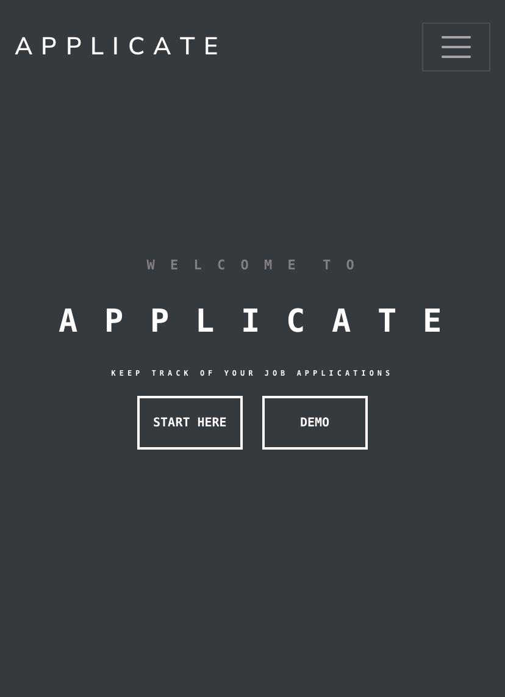

# Applicate - the application tracker project

[Link](https://applicate.netlify.app/) to the live project

## Table of contents
* [General Info](#general-info)
* [Technologies](#technologies)
* [Backend](#backend)
* [Setup](#setup)

## General Info

Applicate is my own job application tracker built with React, NodeJs/Express and MongoDB. Right now as a MVP in _v 1.0 it provides basic features like authentication/authorization, dashboard, own profile, and adding new applications and companies. At the same time I am still improving and adding new features and ideas. This repo contains the frontend of Applicate.

### Screenshot




## Technologies

This project is created with:
* axios version: 0.26.0,
* bootswatch version: 5.1.3,
* jwt-decode version: 3.1.2,
* moment version: 2.29.1,
* react version: 17.0.2,
* react-bootstrap version: 2.1.2,
* react-dom version: 17.0.2,
* react-file-base64 version: 1.0.3,
* react-router-bootstrap version: 0.26.0,
* react-router-dom version: 6.2.1,
* react-scripts version: 5.0.0,
* web-vitals version: 2.1.4


## Backend

Here is the link to the [backend repo](https://github.com/Frisianrage/application-tracker-backend).


## Setup

### Clone the repository from GitHub.

```
$ git clone https://github.com/Frisianrage/application-tracker-frontend.git
```

### Install Dependencies and Run the Server

```
$ npm install
$ npm start
```
